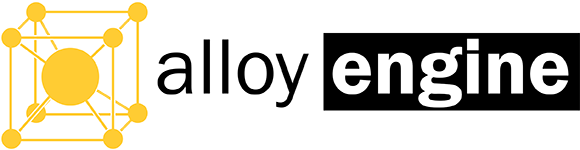

## Summary

**Alloy** is a flexible game-engine and development kit under active
development written in C++.

It is characterized by upholding a strict set of design-goals which
center around maintainability and readability through proper
software engineering practices. The overall goal for this project
is to be a well-rounded and easy-to-use, efficient game-engine.

It is inspired by many great open-source projects that
have come before it, the complete list can be seen
[below](#inspirations).

## Table of Contents

* [Features](#features) \
  A summary of all existing features for the Alloy engine
* [Components](#components) \
  A brief summary of all components in **Alloy**
* [API Reference](https://bitwizeshift.github.io/alloy/api/latest/manual.html) \
  For doxygen-generated API information
* [Tutorials](https://bitwizeshift.github.io/alloy/api/latest/tutorials.html) \
  For tutorials on how to use `alloy`
* [Legal](doc/legal.md) \
  Information about how to attribute this project
* [How to build](doc/building.md) \
  Detailed instructions for how to build the `alloy` library
* [Design Goals](doc/design-goals.md) \
  The design goals of this library
* [Contributing Guidelines](.github/CONTRIBUTING.md) \
  Guidelines that must be followed in order to contribute to the project

## Features

* [x] Written with Modern C++ (C++17)
  * [x] Supports for `constexpr` wherever possible
* [x] Designed using componentized architecture (easier reuse)
* [x] Strong focus on readability and design
* [ ] Supports multiple render systems _(in progress)_
  * [ ] OpenGL
  * [ ] DirectX
  * [ ] Vulkan
* [ ] Supports multiple audio systems _(in progress)_
  * [ ] OpenAL
  * [ ] FMOD
* [ ] Handles intersections of geometric objects
* [ ] Easily build scene graphs and skeletons
* [ ] Manages game objects using entity-component system

## Components

**Alloy** is designed using component-based architecture in order to promote
better logical design and reusability through code-sharing.

The library and application components are detailed below:

### Libraries

* [`Alloy::Core`](lib/alloy-core/README.md) \
  The core library that the rest of **Alloy** is built off of
* [`Alloy::IO`](lib/alloy-io/README.md) \
  The library for managing all IO tasks (filesystem, network, etc)
* [`Alloy::Render`](lib/alloy-render/README.md) \
  The library for managing rendering tasks, and abstracting the
  underlying rendering system (DX, OpenGL, etc)
* [`Alloy::Audio`](lib/alloy-audio/README.md) \
  The library for managing the audio tasks, and abstracting the
  underlying mixing system (FMOD, OpenAL, etc)
* [`Alloy::Engine`](lib/alloy-engine/README.md) \
  The library for managing all engine details, including subsystem
  initialization & coordination, entity-component management,
  resource management, etc.

### Applications

TODO detail applications

## Inspirations

**Alloy** was inspired by a variety of existing open-source projects.
Some of these projects are listed below:

- [Godot](https://github.com/godotengine/godot)
- [Blade](https://github.com/crazii/blade)
- [Ogre](https://github.com/OGRECave/ogre/pulls)
- [Nomad](https://github.com/taurheim/NomadECS)
- [easy-engine](https://github.com/callebstrom/easy-engine)

**Note:** _inspired_ does not mean that any code was taken without following
proper license attribution. It simply means that certain designs and concepts
may have been adjusted to align with what other existing projects are
already doing.

## Tested Compilers

The following compilers are currently being tested through
[continuous integration](#continuous-integration) with
[Travis](https://travis-ci.org/bitwizeshift/alloy) and
[AppVeyor](https://ci.appveyor.com/project/bitwizeshift/alloy/)

| Compiler              | Operating System                   |
|-----------------------|------------------------------------|
| g++ 7.3.0             | Ubuntu 14.04.1                     |
| g++ 8.1.0             | Ubuntu 14.04.1                     |
| clang++ 5.0.2         | Ubuntu 14.04.1                     |
| clang++ 6.0.1         | Ubuntu 14.04.1                     |
| clang xcode 10        | Darwin Kernel 17.7.0               |
| Visual Studio 2017    | Windows Server 2016 (x86)          |
| Visual Studio 2017    | Windows Server 2016 (x64)          |

## Continuous Integration

| **Build**     | **Status**      |
|---------------|-----------------|
| Ubuntu, macOS |  |
| MSVC          |  |

## Current Releases

| **Host**            | **Release**      |
|---------------------|------------------|
| Github              |  |
| Conan               | 

## License

**Alloy** is licensed under the
[MIT License](http://opensource.org/licenses/MIT):

> Copyright &copy; 2018 Matthew Rodusek
>
> Permission is hereby granted, free of charge, to any person obtaining a copy
> of this software and associated documentation files (the "Software"), to deal
> in the Software without restriction, including without limitation the rights
> to use, copy, modify, merge, publish, distribute, sublicense, and/or sell
> copies of the Software, and to permit persons to whom the Software is
> furnished to do so, subject to the following conditions:
>
> The above copyright notice and this permission notice shall be included in all
> copies or substantial portions of the Software.
>
> THE SOFTWARE IS PROVIDED "AS IS", WITHOUT WARRANTY OF ANY KIND, EXPRESS OR
> IMPLIED, INCLUDING BUT NOT LIMITED TO THE WARRANTIES OF MERCHANTABILITY,
> FITNESS FOR A PARTICULAR PURPOSE AND NONINFRINGEMENT. IN NO EVENT SHALL THE
> AUTHORS OR COPYRIGHT HOLDERS BE LIABLE FOR ANY CLAIM, DAMAGES OR OTHER
> LIABILITY, WHETHER IN AN ACTION OF CONTRACT, TORT OR OTHERWISE, ARISING FROM,
> OUT OF OR IN CONNECTION WITH THE SOFTWARE OR THE USE OR OTHER DEALINGS IN THE
> SOFTWARE.
